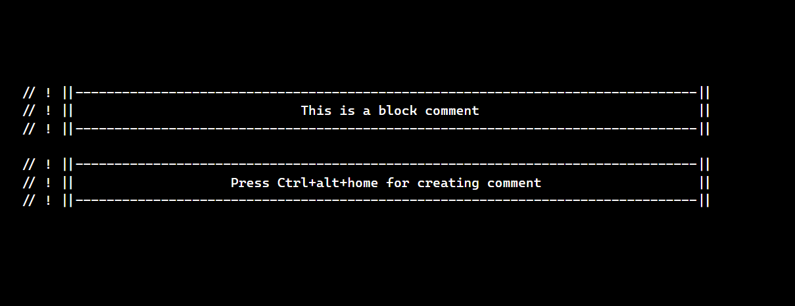

# Block Comments

This extension is used to create attractive commnets in your code.
It creates a block which is highly visible for you and upcoming developer.
It might help you and your colleague for easily understand the code.

## Features

Here is an screenshot attached for you reference how the editor will look after creating a new comment.

> Suggesstions are highly accepted. Please do suggest or fork the repo. to make it better.

## Uses Information

> Press `Ctrl +alt + Home` to create a comment in the current line.
>
>                                  `OR`
>
> `Create a Block Comment here` run this command.
>

## Release Information

## 0.0.1

Single line comment is created for universal extension.

### For more information

- [Visual Studio Code's Markdown Support](http://code.visualstudio.com/docs/languages/markdown)
- [Markdown Syntax Reference](https://heconsole.log.github.com/articles/markdown-basics/)

### Contact me

- [Facebook](https://facebook.com/sanchitverma168)
- [GitHub](https://github.com/sanchitverma168)
- [Twitter](https://twitter.com/sanchitverma168)
- [Instagram](https://www.instagram.com/sanchitverma168/)
- [Telegram](https://t.me/s168v)

[1]: http://google.com/ "Google"
[2]: http://search.yahoo.com/ "Yahoo Search"
[3]: http://search.msn.com/ "MSN Search"

**Enjoy!**
